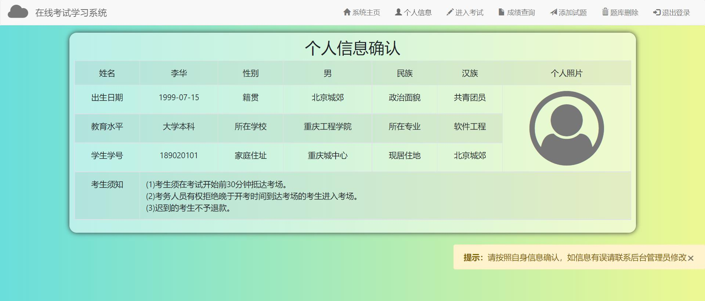
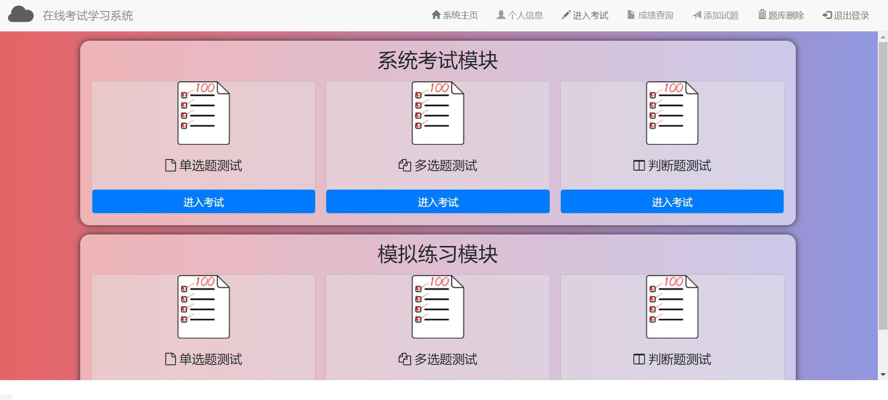
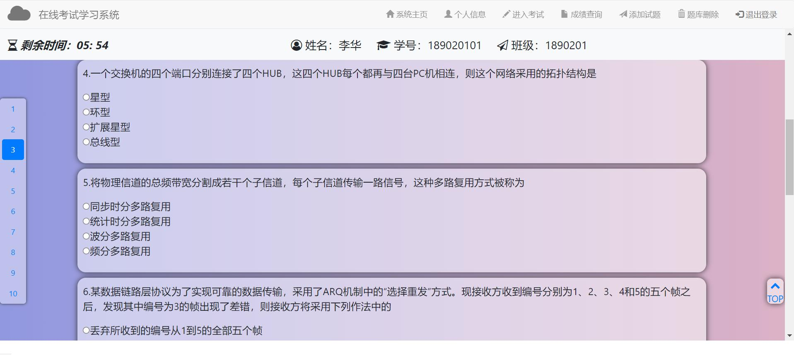
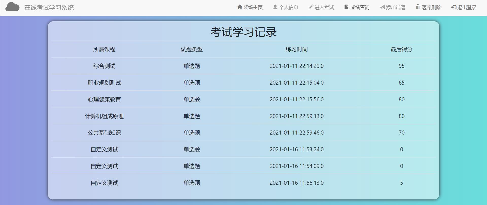
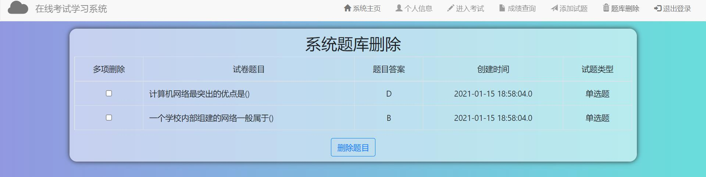

# 在线考试学习系统

## 开发环境
 - JDK 11.0.9、Tomcat v10.0、BootStrap3、MySQL5.7

## 系统说明
 - 使用BootStrap3框架进行前端设计
 - Java后端使用Servle和Jpa进行数据交互
 - 题库导入方法：
  - 将题库文本按**示例题库.docx**格式进行排版
  - 复制需要导入的题目文本，粘贴至指定区域
  - 后台将自动处理文本，分离答案、选项

## 数据库连接
 - 在本地MySQL导入***Exam.sql***
 - 在文件名***DB_Connention.java***更改连接数据库配置
 - 数据库名称**buer**；数据库密码**123456**
 - 数据库地址**按主机地址更改**·

## 系统预览

 - 登录页面

 - 系统首页

 - 个人信息

 - 选择考试

 - 进入考试

 - 查看成绩

 - 添加试题

 - 删除试题



```项目仅为学习使用，文档并不规范```